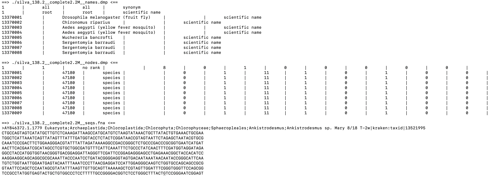

  
```{r set_opts, include=FALSE}
knitr::opts_chunk$set(
  eval = FALSE
)
```


---

> `Silva138.2-Kraken2` database: [download here](#download-silva138.2-kraken2-database) / see end of page
  
> `Silva138.2-Kraken2` database: [skip to code only](#r)

---
        

# Building a Silva138.2 database - preamble

Here we take the most recent release of the [Silva](https://www.arb-silva.de/) database (v.138.2 Silva; 2.2M sequences, [varying lengths](https://www.arb-silva.de/documentation/release-1382#c4414)). 

See also all the roundabout talk regarding [the GG2 version](./documents/k2db_from_gg2.html).
 
---

__of note:__ 

  1.    Silva catalogues sequence data for both the short and large sub-units (SSU & LSU), and as such represents both houses Prokarya and Eukarya.
  2.    Silva `taxid`s do not match NCBI! They don't even match between the SSU & LSU datasets (let alone matching GG2). Heartbreaking. 
  3.    Nor does Silva assign the `species` rank at all, and nor does it assign species-level `taxid`s. Instead, every species is assigned the `taxid` of it's parent, thereby "extending" its parent genus. Having done no research on the matter, I'm not sure why this should be, but it is at least partly the motivation for this code.
  4.    We use `SILVA_138.2_SSU`**`Ref`**`tax_silva.fasta.gz`, and not the `NR99` version (tiny differences are the entire point of using ASVs). However, mighty [`benjjneb` and co.](https://benjjneb.github.io/dada2) use NR99 for their NB-RDP method. Should we follow suit? Probably not - [DADA2 uses a](https://benjjneb.github.io/dada2/assign.html) [twostep](#r) [solution](https://benjjneb.github.io/dada2/assign.html), whereas we are aiming for perfect-firstime-e'rytime.

<br>

# Input files

It's worth looking at the three `Silva` files we need before going any further (they're quite different from the GG2 files, and see also [the README.txt](https://www.arb-silva.de/fileadmin/silva_databases/current/Exports/README.txt)). 

```
208K -rw-rw-r-- 1 hndbls hndbls 206K Jul 11  2024 tax_slv_ssu_138.2.txt.gz
 28M -rw-rw-r-- 1 hndbls hndbls  28M Jul 11  2024 taxmap_slv_ssu_ref_138.2.txt.gz
677M -rw-rw-r-- 1 hndbls hndbls 677M Jul 11  2024 SILVA_138.2_SSURef_tax_silva.fasta.gz

# for a quick look at the contents, try 
gzip -dc /some/silva.file.gz | head

```

<br>


#### 1.`tax_slv_[ls]su_VERSION.txt` [-> link](https://www.arb-silva.de/fileadmin/silva_databases/current/Exports/taxonomy/tax_slv_ssu_138.2.txt.gz)

Each organism's:

  -   path
  -   `taxid`
  -   taxonomic rank
  -   a comment (or not): `a` for enironmental; `w` for due update; or blank.
  -   `Silva` DB version number. 
  
The last two do not matter for this, but `path-taxid-rank` is very helpful. 


<br>

#### 2. `taxmap_TAXNAME_[ls]su_VERSION.txt` [-> link](https://www.arb-silva.de/fileadmin/silva_databases/current/Exports/taxonomy/taxmap_slv_ssu_ref_138.2.txt.gz)


File contains:

  -   `primaryAccession` : found in the header of the sequences. Largey unique, but some are duplicated when more than one hit is detected per reference sequence. 
  -   `start` : starting 5' postiton of the reference sequence in the entry
  -   `stop` : ending 3' postiton of the reference sequence in the entry
  -   `path` : taxonomic descent to the entry, separated by "`;`', and stopping at the parent rank. Note that this is __not__ a standard number of fields, and entries up to 14 ranks are common.
  -   `organism_name` : name of the organism. Poorly standardised, can include `([#\`, and Crom knows what else. **To fix this**, make sure to use `quote = "", comment= ""` when reading the table into `R`.
  -   `taxid` : the taxonomic ID of this entry. Again, note that all the species from the same genus will share the `taxid` of that genus.
  

<br> 


#### 3. `SILVA_138.2_SSURef_tax_silva.fasta.gz` [-> link](https://www.arb-silva.de/fileadmin/silva_databases/current/Exports/SILVA_138.2_SSURef_tax_silva.fasta.gz)

The reference `FASTA` sequences, complete with all-important header:

  - the sequence accession, complete with version numbering. Note that the `primaryAccession` in the `taxmap` file (#2 above) does __not__ contain version numbering (e.g., `AY846372`), while the accession in the `seqs.fna` header does (e.g. `AY846372.1.1779`). 
  - the organism taxonomic _path_ and the organism's _name_, delimited by `;`
  - Like the `organism_name` above, the header contains spaces and other stupid characters like `[`, `(`, '/', and `#`. Stay wide. 
  - The sequence itsself! `A`, `T`, `G`, and `C`.

---

<br> 

# species-level Silva 138.2 - pé sceál

<!-- -   should prob also prepend "x__" guides, as we're going to guess anyway (not implemented) -->
      
Good to keep in mind, `Kraken2` just wants matching `names.dmp`, `nodes.dmp`, and `seqs.fna`, as per the screenshot below. Note that for `names.dmp` and `nodes.dmp`, each field is delimited by `\t|\t` (tab, pipe, tab), including one at the very end for `nodes.dmp`! We set these when we write out the file from `R`, using the `sep = "..."` arg, and we fix that final field in `bash`.

<br>
<!-- {#id .class width=1350 height=450px} -->



<br>

From `Silva`, we need to create the following using the `taxid`s we copy from Silva/create for species level: 

  -   `names.dmp`: `organism_name`, `taxid`, and a bunch of other unimportant stuff we can fake
  -   `nodes.dmp`: `taxid`, `parent_taxid`, `rank`,  and a bunch more unimportant stuff, which we can also fake
  -   `seqs.fna`:   `FASTA`-format DNA sequences, with the header __reformatted__ as: "`>---#1---|kraken:taxid|---#2---`", where `---#1---` is the accession the sequence came with, and `---#2---` is the `taxid` value (either the one copied from `Silva`, or the one we create for species-level assignment).

---        
        
# `R`: re-format `Silva`
        
```{r mostly_r}

    # nano $ref/k2__silva138.2/r_format_s1382-ALL-SEQS.R
      rm(list=ls()) ; gc() 
      
    # attributes, names, length, hist etc. for DNA work
      library("Biostrings")
      library("parallel")
      
      n_cores <- 15

            
##   import SILVA    -----------------------------------------------------------
      
    ## 3 silva files already downloaded to this location
      path <- "/ref/dl"
      
    ## sequnces
      # note silva seqs are in RNA, so need to RNA -> DNA
      length(seqs <- DNAStringSet( 
        readRNAStringSet( 
          filepath = paste0(path, "/SILVA_138.2_SSURef_tax_silva.fasta.gz" ))))  #   2,224,690
      
    ## taxmap
      head(tax <- read.table(paste0( path, 
                                     "/taxmap_slv_ssu_ref_138.2.txt.gz"), header = TRUE, 
                             sep = "\t", quote = "", comment= "" ))   # 2,224,691 lines

    ## taxonomic ranks
      ranks <- read.table(paste0( path, "/tax_slv_ssu_138.2.txt.gz"), 
                          header = FALSE, sep = "\t", quote = "")   # 2,224,691 lines
      colnames(ranks) <- c("path", "taxid", "rank", "comment", "release")

      head(seqs)
      head(ranks)
      head(tax)


    ## get parent_taxid
      ranks$effective_taxon <- gsub( ".*;([\\w\\s\\.\\-\\(\\)\\[\\]]*);$",
                                     "\\1", ranks$path, perl = TRUE )      
      # remove odd characters for better matching
      ranks$path_debracket <- gsub("\\(|\\)", "_", 
                                   gsub("\\[|\\]", "_", ranks$path))      
      ranks$parent_taxid <- unlist( mclapply( 1:nrow(ranks), function(aa){   # aa <- 13

        bb <- strsplit( ranks[ aa , ]["path"][[1]], ";")[[1]]
        if( length(bb) > 1){
          cc <- unlist( ranks[ grep(
            gsub("\\(|\\)", "_", 
                      paste0( c(bb[ 1:length(bb)-1 ],"$"), collapse=";"),
                 perl=TRUE),
            ranks$path_debracket, perl = TRUE) , "taxid" ])
        }else{
          cc <- 1   # assume its at domain level
        }
        if( length( cc ) == 0 ){
          0
        }else if( identical( cc, character(0)) | is.na(cc) | is.null(cc) ){
          NA
        }else{
          cc
          }
      }, mc.cores = n_cores, mc.cleanup = TRUE, mc.preschedule = TRUE))
      head(ranks)

                  
##   expand SILVA taxid to include SPECIES    ----------------------------------

    ## new taxid for species (& strains, substrains, etc.)
      tax$taxid_novo <- tax$taxid
      floop <- 13370000
      # with each unique taxid in tax, get all taxa sharing that parent, and count up from floop
      taxf <- do.call( "rbind", lapply( unique(tax$taxid), function(aa){   # aa <- 58941
        bb <- tax[ tax$taxid_novo == aa , ]
        cc <- floop+nrow(bb)
        bb[ , "parent_taxid" ] <- aa
        bb[ , "taxid_novo" ] <- (floop+1):cc
        floop <<- cc
        bb
      }))  
      
    ## update rank assignment
      taxf$rank <- sapply( taxf$organism_name, function(aa){
        if( grepl( "substr", aa)){
          "substrain"
        }else if( grepl( "subsp", aa)){
          "strain"
        }else if( grepl( "subsp", aa)){
          "subspecies"
        }else{
        "species"
        }
      })
      
      head(taxf)

      
## proto names   -----------------------------------------------------------
      
      head( 
        spec_names <- rbind(
          
          # species-level stuffing
          data.frame( 
            taxid = taxf$taxid_novo,
            name_txt = taxf$organism_name,
            "unique name" = "",
            "name class" = "scientific name",
            stringsAsFactors = FALSE),
          
          # everything else
          data.frame( 
            taxid = ranks$taxid,
            name_txt = ranks$effective_taxon,
            "unique name" = "",
            "name class" = "scientific name",
            stringsAsFactors = FALSE)
          
          ) )

            
## proto nodes   -----------------------------------------------------------
      
      head(
        spec_nodes <- rbind( 
      
          # more species-level stuffing
          data.frame(
            "tax_id" = taxf$taxid_novo,
            "parent tax_id" = taxf$parent_taxid,
            "rank" = taxf$rank,
            "embl code" = "",                   # no one seems to know about this one
            "division id" = 0,                  # 0 = Bacteria (but also apparently Archaea...)
            "inherited div flag" = 1,                            
            "genetic code id" = 11,				      # 11 = Bact/Arch/plastid
            "inherited GC" = 1,             		# 1 if node inherits genetic code from parent
            "mitochondrial genetic code" = 0,		# see gencode.dmp file
            "inherited MGC" = 1,                # 1 if node inherits mitochondrial gencode from parent
            "GenBank hidden" = 0,               # 1 if name is suppressed in GenBank entry lineage
            "hidden subtree root" = 0,          # 1 if this subtree has no sequence data yet
            "comments" = ""),
      
          data.frame(
            "tax_id" = ranks$taxid,
            "parent tax_id" = ranks$parent_taxid,
            "rank" = ranks$rank,
            "embl code" = "",
            "division id" = 0,         
            "inherited div flag" = 1,
            "genetic code id" = 11,
            "inherited GC" = 1,
            "mitochondrial genetic code" = 0,
            "inherited MGC" = 1,
            "GenBank hidden" = 0,
            "hidden subtree root" = 0,
            "comments" = "")
      
        ) )
      
    ## rooting the tree - must be appended to :
      # - names.dmp
      names_proto <- rbind( 
        c( "1", "all", "all", "synonym"),
        c( "1", "root", "root", "scientific name"),
        spec_names
      )
      # - and nodes.dmp (note 8,0,1, instead of 11,1,0)
      nodes_proto <- rbind( 
        c( "1","1","no rank","","8","0","1","0","0","0","0","0",""),
        spec_nodes
      )
      
      
## modify the seq headers    -------------------------------------------------

      ## small difference in sets does not motivate making a subset DB like in GG2
        # s_widths <- width(seqs)    #  subset :: 569 - 1180 - 2260
        # length(seqs_w <- seqs[ s_widths > 1000 & s_widths < 1650 ]) #  2,072,388 
      length(seqs_w <- seqs)                                          #  2,224,690

    ## seqs in current subset
      length( usable_seqs <- seqs_w[ gsub("\\..*", "", names(seqs_w)) %in% tax$primaryAccession ] )    #  2,224,690

    ## accession-wrangling not necessary elsewhere, as we allow K2 to build the seqid2taxid map for us
      names(usable_seqs) <- paste0(
        names(usable_seqs), 
        "|kraken:taxid|", 
        unlist( mclapply( names(usable_seqs), function(aa){      # aa <- names(seqs_w)[403]
          # - first match only below, due to nested hits in the DB
          taxf[ match( gsub( "\\..*","", aa), taxf$primaryAccession ) , "taxid_novo" ]
        }, mc.cores = n_cores, mc.cleanup = TRUE, mc.preschedule = TRUE ))
      )

      
    ## DB issue: some accessions represent multiple overlapping htis
      # bad_acctors <- unlist(sapply(unique(taxf$primaryAccession), function(aa){ if( sum( taxf$primaryAccession == aa) > 1){aa} }))
      # dplyr::filter(taxf, primaryAccession %in% bad_acctors )
      # # - solution :: ignore, as the seq-idf relationship remains valid
      

##   out that!   ---------------------------------------------------------------

      head( nodes_proto )
      head( names_proto )
      head( usable_seqs )

      ## note sep for nodes & names
      writeXStringSet( usable_seqs, filepath = paste0( path, "/silva_138.2__complete2.2M__seqs.fna"), 
                       compress = FALSE, format = "fasta" )

      write.table(names_proto, file = paste0( path, "/silva_138.2__complete2.2M__names.dmp"), 
                  sep = '\t|\t', col.names = FALSE, row.names = FALSE, quote = FALSE)
      write.table(nodes_proto, file = paste0( path, "/silva_138.2__complete2.2M__nodes.dmp"), 
                  sep = '\t|\t', col.names = FALSE, row.names = FALSE, quote = FALSE)

```


# `bash` : post-process & build `Kraken2`

Having made the species levels & `taxid`s, and output the `nodes.dmp`, `names.dmp`, & `seqs.fna`, we now build the `Kraken2` database. We still need to do a small fix to the end of the `nodes.dmp` and `names.dmp` files, as below. I couldn't get the database to build without doing that.

> __NB:__ Buildign a database from scratch skips the first step in the standard database building (e.g. `kraken2-build --download-library bacteria --db $k2db`)

<br>

```{bash mostly_bash}

outdir=/ref/dl
k2db=/ref/k2__silva138.2
mkdir -p $k2db $k2db/taxonomy $k2db/library

cp $outdir/*complete2.2M__nodes.dmp $k2db/taxonomy/nodes.dmp
cp $outdir/*complete2.2M__names.dmp $k2db/taxonomy/names.dmp
cp $outdir/*complete2.2M__seqs.fna $k2db/library/seqs.fna

# fix delimiters!
sed -i -e 's/$/\t|/g' $k2db/taxonomy/names.dmp
sed -i -e 's/$/\t|/g' $k2db/taxonomy/nodes.dmp

```


Your setup should now look like this:

```
$ tree $k2db
# >  ├── library
# >  │   └── seqs.fna
# >  └── taxonomy
# >      ├── names.dmp
# >      └── nodes.dmp
```

Now try building the database:

```{bash more_bash}

# note that we avoid masking, to maximise content of 16S
kraken2-build --add-to-library $k2db/library/seqs.fna --db $k2db --no-masking

# full thing takes GG2: ~90 mins  Silva138.2:
time kraken2-build --build --db $k2db --threads 15


# look
kraken2-inspect --db $k2db | head -n20


kraken2 --db $k2db \
--use-names ${yourdata}/query16S.fna \
--report-zero-counts --report ./query16S.report > ./query16S.output

head -n25  ./query16S.report

```


### download Silva138.2 Kraken2 database

`Silva` is highly curated, thus filtering by sequence length did not really impact the dataset size/feasibility. Enjoy working with the full dataset!

  - ...
  - ...
  - ...
  - ...
  

Honestly, I did _try_ to keep this brief, but I think it's better now that I've removed all the haikus

<!-- ``` -->
<!-- Archaea;        2       domain   -->
<!-- Archaea;Aenigmarchaeota;        11084   phylum          123 -->
<!-- Archaea;Aenigmarchaeota;Aenigmarchaeia; 42913   class           138 -->
<!-- Archaea;Aenigmarchaeota;Aenigmarchaeia;Aenigmarchaeales;        42914   order           138 -->
<!-- ``` -->


<!-- Below we have an example of three model organism entries - one for the brown rat, one for the house fly, and one for _L. lcatis_! "_L.lactis_ isn't a model organism!" you roar from the footpath, but this reproach is torn away under the noise of the traffic. Look at how long the eukaryotic paths are!  -->

<!-- ``` -->
<!-- primaryAccession        start   stop    path    organism_name   taxid -->
<!-- AX664486        3       1987    Eukaryota;Amorphea;Obazoa;Opisthokonta;Holozoa;Choanozoa;Metazoa;Animalia;BCP clade;Bilateria;Protostomia;Ecdysozoa;Arthropoda;Hexapoda;Insecta;Pterygota;Neoptera;Diptera;     Drosophila melanogaster (fruit fly)     47180 -->
<!-- CS214259        13      1872    Eukaryota;Amorphea;Obazoa;Opisthokonta;Holozoa;Choanozoa;Metazoa;Animalia;BCP clade;Bilateria;Deuterostomia;Chordata;Vertebrata;Gnathostomata;Euteleostomi;Tetrapoda;Mammalia;  Rattus norvegicus (Norway rat)  47087 -->
<!-- BH771024        532     2058    Bacteria;Bacillota;Bacilli;Lactobacillales;Streptococcaceae;Lactococcus;        Lactococcus lactis subsp. cremoris MG1363       58938 -->

